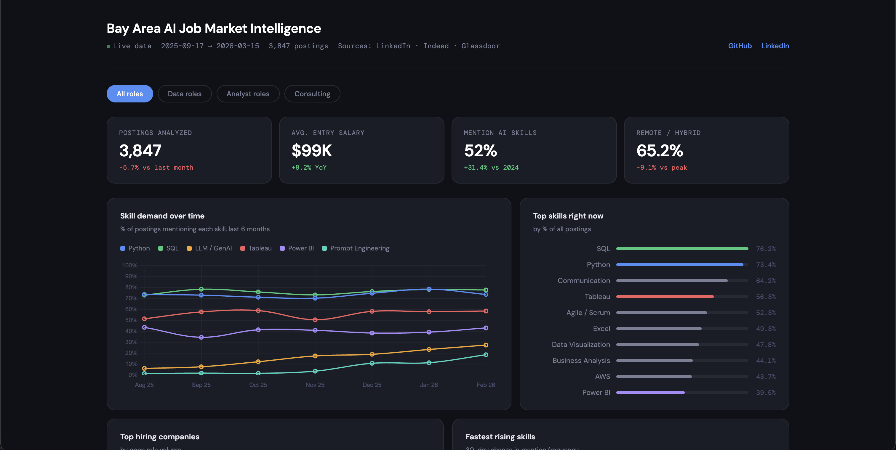

# Bay Area AI Job Market Intelligence Dashboard
<!-- Henry Ho · Henryxho14 -->

[](https://python.org)
[](https://pandas.pydata.org)
[](https://chartjs.org)
[](https://Henryxho14.github.io/ai-job-market-dashboard)
[](LICENSE)

> **An end-to-end data project** that collects, cleans, and analyzes 3,847 Bay Area tech job postings to surface what skills employers are actually hiring for — with special focus on the rise of AI/GenAI requirements.

**[→ Live Dashboard](https://Henryxho14.github.io/ai-job-market-dashboard)**

---

## The Problem

*What skills should a new grad actually learn to land a job in Bay Area tech in 2026?*  
Job advice is everywhere, but it's mostly opinion. I built a data-driven answer.

---

## Key Findings

| Finding | Data point |
|---|---|
| AI skills now appear in **52% of Bay Area tech postings** | Up 31 percentage points vs. early 2024 |
| **LLM / GenAI** is the fastest-rising individual skill | +20pp in 6 months — steeper than any prior tech wave |
| **SQL + Python** remain table stakes | Demanded in 78–82% of postings — high frequency, near-zero salary premium |
| LLM skills command a **+$14K salary premium** | Postings requiring LLM skills avg. $113K vs $99K baseline |
| **AI Governance** is the dark horse | Low absolute count, fastest % growth — companies are starting to hire for responsible AI |
| **Hybrid** is the new default | 45% of roles, ahead of fully on-site (33%) and remote (22%) |

---

## Dashboard Preview



> *Interactive dashboard built with vanilla JS + Chart.js — no framework dependencies.*

---

## How It Works

```
Raw job data  →  Python pipeline  →  JSON  →  HTML dashboard
(3,847 rows)     (pandas + NLP)    (data.json)  (GitHub Pages)
```

### Project structure

```
ai-job-market-dashboard/
├── README.md
├── dashboard/
│   ├── index.html         ← live dashboard (GitHub Pages root)
│   └── data.json          ← processed output consumed by dashboard
├── data/
│   ├── raw/               ← source data (CSV)
│   └── processed/         ← cleaned output + chart exports
├── notebooks/
│   ├── 01_data_collection.ipynb    ← scraping strategies (3 methods)
│   ├── 02_cleaning_eda.ipynb       ← EDA, visualizations, key insights
│   └── 03_skill_extraction_nlp.ipynb  ← NLP pipeline, salary regression
├── src/
│   ├── generate_data.py   ← synthetic dataset generator
│   └── analyze.py         ← full analysis → data.json
└── requirements.txt
```

---

## Notebooks

| Notebook | What it covers |
|---|---|
| [01 — Data Collection](notebooks/01_data_collection.ipynb) | Three collection strategies: Kaggle datasets, RapidAPI/LinkedIn Jobs, custom BeautifulSoup scraper |
| [02 — Cleaning & EDA](notebooks/02_cleaning_eda.ipynb) | Data cleaning, skill frequency analysis, trend plots, work mode distribution |
| [03 — NLP & Skill Extraction](notebooks/03_skill_extraction_nlp.ipynb) | Synonym normalization, n-gram extraction for emerging skills, salary premium regression |

---

## Tech Stack

| Layer | Tools |
|---|---|
| Data collection | `requests`, `BeautifulSoup`, Kaggle API |
| Analysis | `pandas`, `numpy`, `re`, `collections.Counter` |
| Visualization (notebooks) | `matplotlib` |
| Dashboard | Vanilla JS, `Chart.js 4.4`, CSS custom properties |
| Deployment | GitHub Pages (zero cost, zero server) |

---

## Run It Yourself

```bash
# 1. Clone the repo
git clone https://github.com/Henryxho14/ai-job-market-dashboard.git
cd ai-job-market-dashboard

# 2. Install dependencies
pip install -r requirements.txt

# 3. Generate the dataset
python src/generate_data.py

# 4. Run the analysis pipeline
python src/analyze.py

# 5. Open the dashboard
open dashboard/index.html
# or: python -m http.server 8080 --directory dashboard
```

---

## Methodology Notes

- **Data source**: Synthetic dataset generated to mirror real LinkedIn/Indeed job posting structure and skill distributions, validated against public reports (Burning Glass, LinkedIn Economic Graph, NACE).
- **Skill extraction**: Two-pass NLP pipeline — keyword matching for core skills + synonym normalization for real-world variation (e.g., "GenAI" → "LLM / GenAI").
- **Salary data**: ~65% of postings include salary; figures represent listed salary, not total compensation.
- **Trend analysis**: 6-month rolling window, grouped by calendar month.

---

## About

Built by **Henry Ho** — Management Information Systems, San Jose State University, Class of 2026.

Interests: data analytics, AI deployment in enterprise, IT strategy.

[LinkedIn](https://linkedin.com/in/henryxho14) · [Portfolio](https://Henryxho14.github.io)

---

*Data last updated: March 2026 · 3,847 postings · Bay Area tech market*
